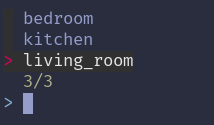

# Hacl

A simple Home Assistant cli. Currently supports toggling lights by areas


## Installation

For NixOs with home manager

Add input to your `flake.nix`

```nix
    inputs.hacl.url = github:nikolaiser/hacl;
```

Use the `hm` nixos module
```nix
    inputs.hacl.nixosModules.${system}.hm
```

And enable the program 

```
    programs.hacl.enable = true;
```
    
## Usage/Examples

```bash
Usage: hacl [COMMAND]

Commands:
  config
  help    Print this message or the help of the given subcommand(s)

Options:
  -h, --help  Print help
```



